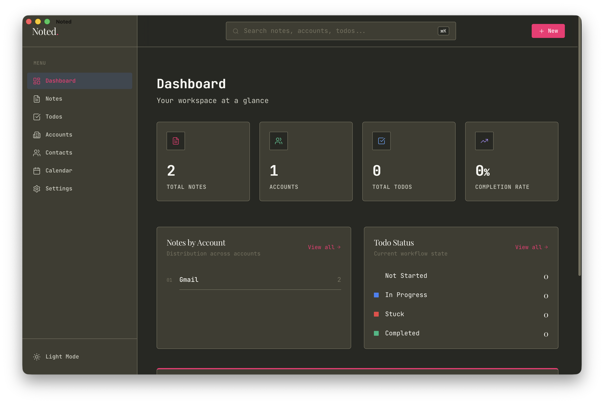
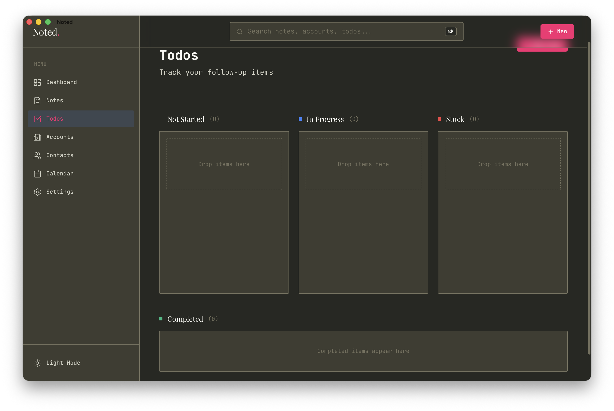
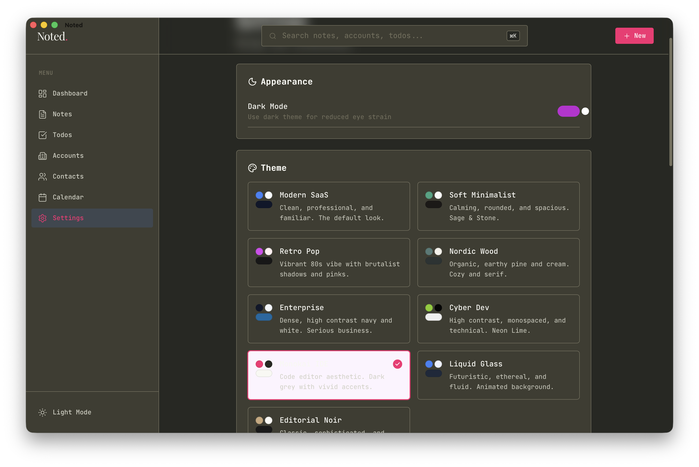

<p align="center">
  
</p>

<h1 align="center">Noted</h1>

<p align="center">
  <strong>A beautiful, local-first notes app for Solutions Engineers</strong>
</p>

<p align="center">
  Organize meeting notes • Track follow-ups • Manage customer accounts
</p>

<p align="center">
  <a href="#features">Features</a> •
  <a href="#installation">Installation</a> •
  <a href="#screenshots">Screenshots</a> •
  <a href="#tech-stack">Tech Stack</a> •
  <a href="#api">API</a>
</p>

<p align="center">
  
  
  
  
  
  
</p>

---

## Why Noted?

Built specifically for **Solutions Engineers** who juggle dozens of customer conversations. Stop losing context between meetings. Keep everything organized, searchable, and actionable.

```
📝 Meeting notes with rich text editing
📊 Kanban board for follow-ups  
📅 Calendar integration
🔍 Instant full-text search
🎨 Beautiful themes
```

---

## Features

<table>
<tr>
<td width="50%">

### 📝 Smart Notes
- Rich text editor with code blocks
- Organize by customer account
- Pin, archive, and tag notes
- File attachments
- Export to PDF
- Drag-to-reorder

</td>
<td width="50%">

### ✅ Kanban Todos
- 4-column workflow board
- Drag-and-drop cards
- Link todos to notes
- Priority badges (H/M/L)
- Filter & bulk operations

</td>
</tr>
<tr>
<td width="50%">

### 📅 Calendar Sync
- Apple Calendar integration
- Week, Month, Agenda views
- Create notes from events
- Auto-populate participants

</td>
<td width="50%">

### 👥 Contact Management
- Auto-extract from meetings
- Internal vs external tracking
- Domain-based suggestions
- Meeting history per contact

</td>
</tr>
<tr>
<td width="50%">

### 📊 Dashboard
- Overview stats at a glance
- Incomplete fields tracker
- Activity timeline
- Quick navigation

</td>
<td width="50%">

### 🎨 Themes
- Modern SaaS (default)
- Liquid Glass
- Retro / Nordic / Corporate
- Dark mode support

</td>
</tr>
</table>

---

## Installation

### 🖥️ Native macOS App (Recommended)

Download the latest release or build from source:

```bash
# Clone and build
git clone https://github.com/factory-sagar/noted.git
cd noted
make wails-build

# Install
cp -r backend/cmd/wails/build/bin/Noted.app /Applications/
```

### 🐳 Docker

```bash
docker-compose up
# Open http://localhost:3000
```

### 🛠️ Development

**Prerequisites:** Go 1.24+, Node.js 20+

```bash
# Backend (port 8080)
cd backend && go run ./cmd/server/

# Frontend (port 5173)  
cd frontend && npm install && npm run dev
```

Or use Make:
```bash
make dev          # Run both
make dev-backend  # Backend only
make dev-frontend # Frontend only
```

---

## Screenshots

<p align="center">
  
</p>

<p align="center">
  
  
</p>

---

## Tech Stack

| Layer | Technology |
|-------|------------|
| **Frontend** | SvelteKit 2.x, Tailwind CSS, TipTap Editor |
| **Backend** | Go 1.24+, Gin Framework |
| **Database** | SQLite with FTS4 (full-text search) |
| **Native App** | Wails v2 (macOS) |
| **Calendar** | Apple EventKit |

---

## Project Structure

```
noted/
├── backend/
│   ├── cmd/
│   │   ├── server/          # HTTP server
│   │   └── wails/           # Native app
│   └── internal/
│       ├── handlers/        # API handlers
│       ├── calendar/        # EventKit bridge
│       └── db/              # SQLite + migrations
├── frontend/
│   └── src/
│       ├── routes/          # Pages
│       ├── lib/components/  # UI components
│       └── lib/stores/      # State management
└── docs/                    # API documentation
```

---

## API

Full REST API with 70+ endpoints. See [docs/API.md](docs/API.md) for complete documentation.

<details>
<summary><strong>Quick Reference</strong></summary>

| Resource | Endpoints |
|----------|-----------|
| Accounts | `GET/POST/PUT/DELETE /api/accounts` |
| Notes | `GET/POST/PUT/DELETE /api/notes` |
| Todos | `GET/POST/PUT/DELETE /api/todos` |
| Tags | `GET/POST/PUT/DELETE /api/tags` |
| Contacts | `GET/POST/PUT/DELETE /api/contacts` |
| Calendar | `GET /api/calendar/events` |
| Search | `GET /api/search?q=term` |
| Analytics | `GET /api/analytics` |
| Export | `GET /api/export` |

</details>

---

## Configuration

| Variable | Default | Description |
|----------|---------|-------------|
| `PORT` | 8080 | Server port |
| `INTERNAL_DOMAIN` | example.com | Your company's email domain |

```bash
# Example: Set your company domain for contact classification
export INTERNAL_DOMAIN=mycompany.com
```

---

## Keyboard Shortcuts

| Shortcut | Action |
|----------|--------|
| `⌘ K` | Global search |
| `⌘ ⇧ C` | Quick capture |
| `⌘ S` | Save note |

---

## Roadmap

- [x] Apple Calendar integration
- [x] Contact management
- [x] Multiple themes
- [x] Data export/import
- [ ] Multi-user support
- [ ] iOS/Android companion app
- [ ] AI-powered note summaries

---

## Contributing

Contributions are welcome! Please read [CONTRIBUTING.md](CONTRIBUTING.md) for guidelines.

```bash
# Setup hooks
make setup-hooks

# Run checks before committing
npm run check        # Frontend
go vet ./...         # Backend
```

---

## License

MIT License - see [LICENSE](LICENSE) for details.

---

<p align="center">
  <sub>Built with ☕ for Solutions Engineers everywhere</sub>
</p>
